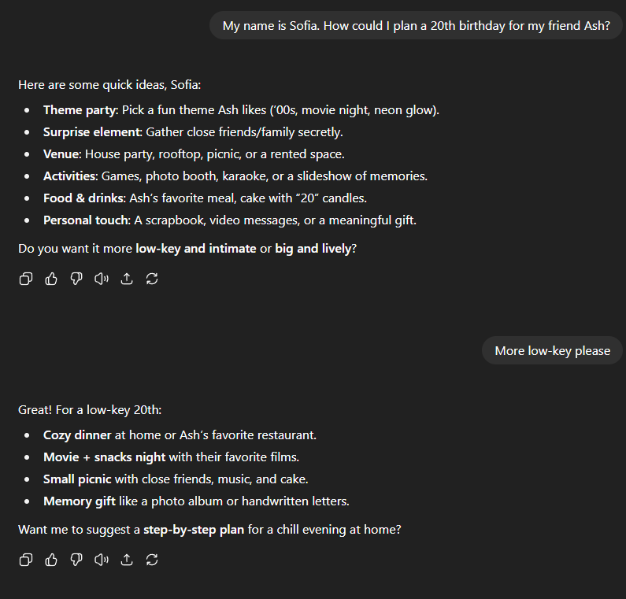
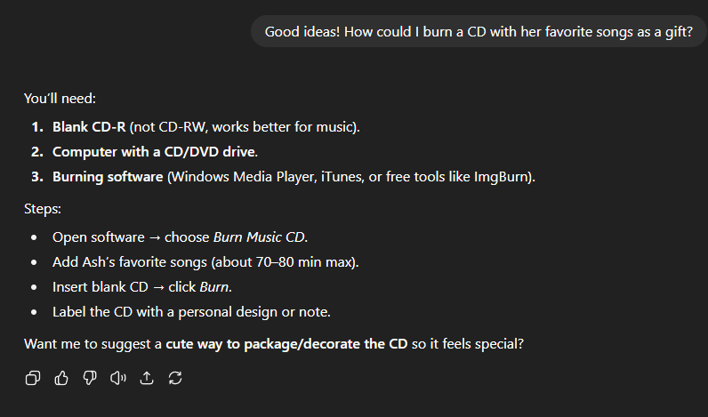

<h1 id='title'>Assignment 1</h1> 

ELIZA Mini-Lab -- Exploring Weizenbaum's DOCTOR (1966)

By Sofía Maldonado García

Course: Minería de Textos

Professor: Juan Antonio Vega Fernandez

*********

Activities

Activity 1: Memory & Quitting

***Using ELIZA Archaeology Demo***  

Start of Transcript

<code>
    
    HOW DO YOU DO. PLEASE TELL ME YOUR PROBLEM

    I am 20 years old, I am having issues with my parents

    **IS IT BECAUSE YOU ARE 20 YEARS OLD THAT YOU CAME TO ME**

    no, it is because I have issues with my parents

    **ARE YOU SAYING 'NO' JUST TO BE NEGATIVE**

    no

    **YOU ARE BEING A BIT NEGATIVE**

    I do not think I am

    **HOW LONG HAVE YOU BEEN**

    about a year

    **I AM NOT SURE I UNDERSTAND YOU FULLY**

    how old am I?

    **WHY DO YOU ASK**

    I am curious if you remember

    **DO YOU THINK ITS LIKELY THAT I REMEMBER**

    maybe

    **YOU DON'T SEEM QUITE CERTAIN**

    I don't know, that is why I asked

    **DON'T YOU REALLY KNOW**

    how old am I?

    **DOES THAT QUESTION INTEREST YOU**

    yes

    **YOU SEEM QUITE POSITIVE**

    yes

    **YOU ARE SURE**

    yes

    **I SEE**

    how old am I?

    **WHAT IS IT YOU REALLY WANT TO KNOW**

    bye

    **PLEASE GO ON**

</code>

From what I gathered, it seems that ELIZA has trouble remembering personal data like my age. I also did another test in which I told it my name, and ELIZA directly told me that it wasn't interested in knowing my name, straight up telling me: <code>I AM NOT INTERESTED IN NAMES</code>. 

Something that I did find interesting is that it really wants you to keep talking to it. It told me <code>PLEASE GO ON</code> when I said "bye", and it also said it when I used the word "quit". 

In this example, a keyword that definitely fired was "no". After using it only once it accused me of having a negative tone, something I couldn't shake off even after strictly denying it. A reassembly rule I believe it used was it telling me at the very beginning if I came to it because I am 20 years old.

Activity 2: Recreate the CACM dialogue

***Using mass:werk ELIZA Test Page***

Start of Transcript

<code>

    ELIZA: Is something troubling you ?
    YOU:   Women are all alike
    ELIZA: How ?
    YOU:   They're always bugging us about something or other
    ELIZA: Can you think of a specific example ?
    YOU:   Well, my girlfriend made me come here
    ELIZA: Your girlfriend made you come here ?
    YOU:   She said I'm depressed much of the time
    ELIZA: Can you explain what made you depressed ?
    YOU:   I feel like she controls me a lot
    ELIZA: Tell me more about such feelings.
    YOU:   I can only go out if she allows it
    ELIZA: What would you do if she allows it ?
    YOU:   I would go out, but I don't want to only because she allows it
    ELIZA: You say you would go out ?
    YOU:   yes
    ELIZA: I see.

</code>

For this example, I substituted the "Men are all alike" from the CACM with "Women are all alike". Right as I told it that I was depressed it deviated from the original. Now, instead of feeling sorry for me, it asks me to explain my feelings directly, and tried to deepen the conversation. 

The answer of it just asking me again if my girlfriend made me come here was an example of a reassembly rule. A keyword which I believed fired in the end was the "yes" as it made it recognize my desire to go out. 

Activity 3: Trace Mode (ELIZA Archaeology)

***Using ELIZA Archaeology***

Start of Transcript

<code>
    
    HOW DO YOU DO. PLEASE TELL ME YOUR PROBLEM

    *traceauto

    tracing enabled
    I feel like a failure

    | input: I FEEL LIKE A FAILURE
    | LIMIT: 2 (HMMM)
    | word substitutions made: I/YOU
    | found keywords in subclause: YOU FEEL LIKE A FAILURE
    | keyword(precedence) stack: LIKE(10), I(0)
    | memory queue: <empty>
    | selected keyword: LIKE
    | input: YOU FEEL LIKE A FAILURE
    | matching decompose pattern: (0)
    | decomposition parts: 1:"YOU FEEL LIKE A FAILURE"
    | selected reassemble rule: (NEWKEY)
    | selected keyword: I
    | input: YOU FEEL LIKE A FAILURE
    | matching decompose pattern: (0 YOU FEEL 0)
    | decomposition parts: 1:"", 2:"YOU", 3:"FEEL", 4:"LIKE A FAILURE"
    | selected reassemble rule: (TELL ME MORE ABOUT SUCH FEELINGS)
    TELL ME MORE ABOUT SUCH FEELINGS

    I don't have friends

    | input: I DON'T HAVE FRIENDS
    | LIMIT: 3 (GO ON , PLEASE)
    | word substitutions made: I/YOU
    | found keywords in subclause: YOU DON'T HAVE FRIENDS
    | keyword(precedence) stack: I(0)
    | memory queue: <empty>
    | selected keyword: I
    | input: YOU DON'T HAVE FRIENDS
    | matching decompose pattern: (0 YOU DON'T 0)
    | decomposition parts: 1:"", 2:"YOU", 3:"DON'T", 4:"HAVE FRIENDS"
    | selected reassemble rule: (DON'T YOU REALLY 4)
    DON'T YOU REALLY HAVE FRIENDS

    I do not

    | input: I DO NOT
    | LIMIT: 4 (I SEE)
    | word substitutions made: I/YOU
    | found keywords in subclause: YOU DO NOT
    | keyword(precedence) stack: I(0)
    | memory queue: <empty>
    | selected keyword: I
    | input: YOU DO NOT
    | matching decompose pattern: (0)
    | decomposition parts: 1:"YOU DO NOT"
    | selected reassemble rule: (YOU SAY 1)
    YOU SAY YOU DO NOT

</code>

In the first trace, the one after telling it that I feel like a failure, it quickly gave "like" precedence on the stack of keywords. It also selected the `NEWKEY` reassembly rule which turned into `TELL ME MORE ABOUT SUCH FEELINGS`, its answer. Something I find interesting in all three traces is that hte memory queue is empty, which shows that it isn't really caring to store any of the answers. This is obvious; for example, the third answer completely disregards what it answered previously. It isn't taken into account. 

***

Comparison vs Modern LLMs.

From these brief interactions with ELIZA, I can see three places where it lacks:
<li> Failure to store memory
<li> Disinterest in specific user details
<li> Limited range of issues it can answer for 
  
These are all things that work very differently in modern models like GPT-5. New LLMs definitely store important context information like your name and age, even details from previous chats (OpenAI calls this feature "memories"). For example, this is a conversation with ChatGPT-4.  

  
    
  
ChatGPT-4 values information like a person's age and their name (it reiterates that my friend is turning 20) and it even uses that information for the suggestions; for example, it suggests a cake with 20 candles, and suggests renting a rooftop for a party which it would probably not suggest if this were a party for a small child. 